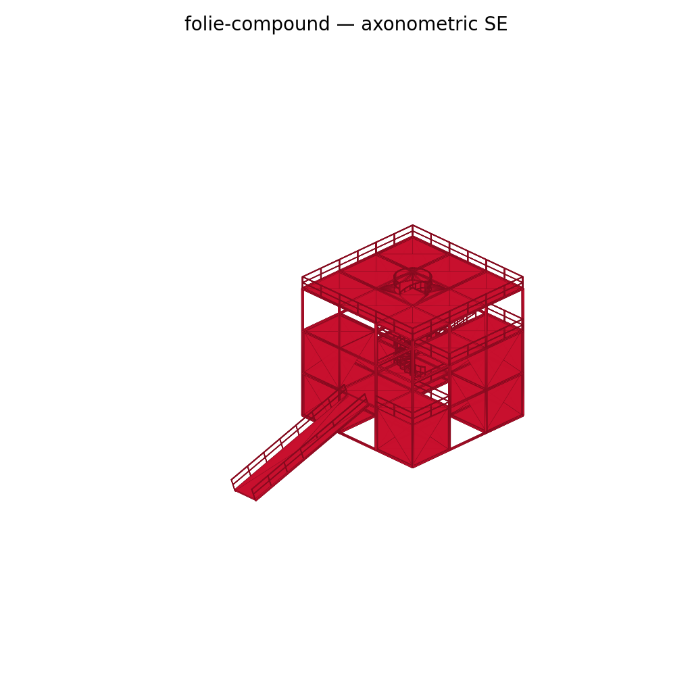

# Tschumi Folie Generator

[](https://github.com/eliosuperfluido/folie-generator/actions/workflows/ci.yml)



Generate accurate 3D geometry of Bernard Tschumi's Parc de la Villette folies as `.glb` files. A formal grammar enforces the Villette rule system; an autofix layer patches common spec errors before geometry is built; a validator confirms accessibility, support, and non-overlap on every emission.

Output is importable into Rhino 8, Unreal Engine (via the glTF Runtime plugin), or any web viewer that speaks glTF 2.0.

This document is the canonical entry point. It's organized by task, not by reader — whether you're authoring a spec by hand, asking an LLM to author one, or extending the generator, the section that addresses your task is the section to read.

## Quick start

```bash
pip install -r requirements.txt
python3 execution/generate_folie.py \
    --spec examples/folie-compound.json \
    --out  generated/folie-compound/out --open
```

Produces `folie-compound.glb`, a resolved spec, a validation report, and (with `--open`) launches `execution/viewer.html` to inspect the result.

## Tschumi's 7 rules — the system

These are the authoritative rules of the Villette system. The grammar in `references/folie-grammar.md` is their implementation; the table below is the spec.

| # | Rule | Kind |
|---|---|---|
| **1** | The frame. Every folie is a 10.8 m cubic cage in red enameled steel, subdivided into a 3×3×3 lattice of 3.6 m sub-cubes. Invariant. | possibility — strictly enforced |
| **2** | The point grid. Each folie sits on a node of the orthogonal 120 m grid overlaying the park. Position is not a design decision. | possibility — enforced |
| **3** | The vocabulary. A closed kit of secondary elements: cylinder (drum/tower), wedge, ramp, straight stair, helical stair, curved arc, canopy, planar wall fragment, cantilevered platform/balcony. | possibility — enforced (with `raw_beam` as declared escape hatch) |
| **4** | The operations. A folie is produced by Addition, Subtraction, Insertion, Repetition, Distortion, Substitution. | possibility — enforced as primitives |
| **5** | Material & colour. Red enamel on steel (≈ RAL 3020), concrete plinth. No other colour on the folie itself. | possibility — enforced |
| **6** | Disjunction of form and program. Program (café, kiosk, belvedere, daycare, first-aid) is assigned *after* form is fixed. Programless folies are valid outputs. | intent — not enforced; left open |
| **7** | Legibility of the type. No operation may dissolve the cubic cage entirely. Every folie reads as a variation of the same cube. | possibility — enforced |

Rules 1, 2, 5, 7 are *constants* (invariants). Rules 3, 4 are the *generator* — a combinatorial kit. Rule 6 is the philosophical move that makes the system Tschumi rather than a formal exercise.

The generator enforces possibility rules strictly and leaves intent rules open. Don't accumulate "rules" until they close off the intent space — stylistic preferences (tower vs. centre, symmetric vs. asymmetric, open vs. closed) are authorial choices.

## Generating a folie

The workflow below works whether a human writes the spec or an LLM proposes it in conversation. The questions to answer are the same; only the medium differs.

1. **How many folies?** — single folie, or a field of N folies on the Villette grid.
2. **Which grid position(s)?** — the Villette grid uses 120 m spacing. Single folies default to origin `[0, 0]`. For a field, name the cells (rows A–G × cols 1–8).
3. **Random or guided?**
   - *Random* — give a seed (or accept one). The generator composes a Tschumi-compliant folie stochastically within the grammar. The seed is the whole story.
   - *Guided* — write a rationale first (one to three Tschumi principles cited, see `references/tschumi-principles.md`), then a spec that executes it. The rationale is a first-class artifact (`<name>.rationale.json`, `references/rationale-schema.md`).
4. **Decomposition intensity** (guided only) — light / moderate / heavy. Governs how many sub-cube cells become solid, how many attachments are added, how much dislocation.
5. **Seed** — for reproducibility. Always recorded in the spec.

For a field of N folies, each folie gets its own rationale, and `relation_to_predecessors` forces each new folie to differ from prior folies in a stated way.

If the grammar cannot express the intent, revise the rationale — not the grammar.

## Authoring a spec

A minimal spec:

```json
{
  "defaults": { "color": "#C8102E", "grid_spacing": 120 },
  "folies": [
    { "grid_pos": [0, 0], "seed": 42 }
  ]
}
```

When only `grid_pos` and `seed` are given, the generator fills in cube state and attachments stochastically. Pin specific cube states and attachments for determinism — see `references/spec-schema.md` for the full schema.

The generator's CLI:

```bash
python3 execution/generate_folie.py --spec PATH --out DIR [--open]
```

Flags:
- `--spec PATH` — path to spec JSON (required)
- `--out DIR` — output directory (default `./out`)
- `--open` — launch the local viewer after generation

Output:

```
out/
├── <name>.glb              # geometry
├── <name>.spec.json        # resolved spec (seeds applied, target_z → length, etc.)
├── <name>.rationale.json   # guided mode only
├── <name>.validation.json  # checker report
└── renders/                # 6 orthographic PNGs
```

## Viewing and exporting

- **`execution/viewer.html`** — local three.js viewer with PBR materials, IBL, ACES tone mapping. Toggle a 3-axis cell-coordinate label system (A1-I … C3-IV with a level-IV roof slab) for visual collaboration.
- **Rhino 8** — File → Import → `.glb` works natively.
- **Unreal Engine** — Datasmith Runtime does not ingest `.glb` directly. Use [glTF Runtime](https://github.com/rdeioris/glTFRuntime) alongside it.
- **Scale** — the `.glb` is in metres. Rhino and Unreal default to centimetres / Unreal-units; set the import scale accordingly (×100 for Unreal).
- **`.glb`, not `.gltf`** — single binary, embedded materials, cleaner for cloud transfer.

## Showcase

Two specs in `examples/` produce the canonical showcase:

- **`folie-compound.json`** — single-folie showcase exercising every primitive in one cube: solid corner blocks at three heights, decks at +3.6 / +7.2 / +10.8 m with a circular roof cutout, a ramp ground→L1, a one-module straight cantilever stair L1→L2, a 2-revolution helical stair L1→L3 with a pac-man landing, fall-protection rails everywhere they're needed.
- **`folie-field-4x4.json`** — sixteen distinct folies on the 120 m grid, all in one `.glb`. Demonstrates the field — Tschumi's emphasis on "the field, not the folie."

The corresponding `.glb`, validation report, and six orthographic renders live in `generated/<name>/out/` and are checked into the repo so visitors can browse them directly on GitHub without cloning. CI regenerates them on every PR — commit the regenerated artefacts alongside any change that affects geometry. Both specs are also exercised by the test suite.

## Extending the grammar

The grammar lives in `references/folie-grammar.md`. It formalises the Villette rule system: base envelope (§1), cube states (§2), attachment vocabulary (§3), valid anchor points (§4), transformation rules (§5), assembly rules (§6), field rules (§7), LOD and dimensional honesty (§8), support requirements (§9), accessibility hard rules (§9bis = R1–R4), non-overlap (§10), banned operations (§11).

Process for proposing a grammar change:

1. **Read `test-log.md` first.** Most investigations have been run before. Don't repeat them.
2. **Distinguish possibility from intent.** Possibility rules (geometric, structural, accessibility) get strict enforcement. Intent rules (program, stylistic preference) stay open.
3. **Add the rule, the autofix, the validator check, and the test together.** A new rule that the validator doesn't catch isn't a rule.
4. **Append to `test-log.md`** with the motivating case, the rule, and any tradeoffs.
5. **After 5+ similar findings**, promote the pattern to a grammar rule and remove the individual entries.

Cube invariants — 10.8 m edge, 3×3×3 subdivision, red primary colour, 120 m grid — are Tschumi's, not this repo's. Changing them requires a source citation.

## Editing the generator

The generator (`execution/generate_folie.py`) builds geometry from a spec, runs the autofix loop, and writes the validation report.

**Mandatory four-step protocol after any edit to the generator, the grammar, an attachment builder, or a spec:**

1. `python3 -m pytest tests/` — tests pass.
2. Regenerate the affected folie(s) — `Valid: PASS  warn=0 error=0`.
3. `python3 execution/render_folie.py --glb <generated.glb> --out <renders/>`.
4. **Read at least one render** before reporting the change as done. The validator catches grammar errors but not visual ones (post density, rail breaks, primitive overlaps that pass the bbox check).

If a change could affect every showcase folie (a builder default, an §R rule, an autofix branch), do steps 2–3 for *all* of `generated/*` and confirm the autofix log entries are sane. "It compiled" is not a stand-in for "it's correct."

### Implementation pitfalls

These bugs are not catchable by the validator and don't fit cleanly into the grammar:

- **Sub-cell coordinates are floating-point.** `int(7.2 // 3.6) == 1`, not 2 — the cell-index calculation drops you one cell short half the time when a terminus sits on a sub-cell boundary. When mapping a world point to `(col, row)`, snap with a tolerance (~7 cm) and bias by the direction of travel. Reference: `_open_platform_ingress._snap`.
- **Browser cache defeats `?t=…` cache-busting.** `viewer.html` fetches the `.glb` via its own loader, which respects the browser cache regardless of the URL query. Always hard-refresh (Ctrl+Shift+R) after regenerating; verify the server-side timestamp before assuming the file is identical.
- **Viewer label coordinates are Y-up; spec coordinates are Z-up.** The exporter rotates the scene −90° about X, so `spec_y → -viewer_z` and `spec_z → viewer_y`. Any annotation placed in the viewer must use viewer-frame coordinates.

For the *what* rules behind these — rail-as-fall-protection (§R3), anchor + terminus rail interaction (§R4), curved rail post spacing (§8 Dimensional honesty), auto-feature reachability precondition (§R1) — see `references/folie-grammar.md`.

### Authorship levels

Three levels of LLM authorship are supported, with decreasing scaffolding:

- **Level 3 — scripted (default).** A JSON spec → the generator builds geometry and enforces the grammar mechanically. Use for every folie unless you have a specific reason not to.
- **Level 2 — free Python.** A self-contained `trimesh` script that builds the `.glb` directly, bypassing the grammar. Reach for this only when a gesture demands it (continuous wrap ramps, full-perforation drums, off-grid landings) and audit the result against P4–P5 by hand. Findings from the first Level 2 session: free-form authorship over-reaches; the grammar's parameter bounds are authorship discipline, not just structural enforcement.
- **Level 1 — raw vertex authorship.** Not implemented. Of theoretical interest only.

## What does NOT belong in a folie

- Glazing mullions, furniture, site landscaping. The folies are the product; the rest is context the model doesn't carry.
- Cube sizes other than 10.8 m. Subdivisions other than 3.
- Non-red primary materials.
- Folies off the 120 m grid.
- Ramps or stairs with termini in mid-air. Both ends must be supported (ground / cube face / platform cell).
- Two attachments occupying substantially the same volume. Intentional intersections (ramp through frame, drum clipping into cube) are fine; two stairs in identical space are not.

## References

- `references/folie-grammar.md` — formal grammar, enforced on every emission.
- `references/spec-schema.md` — JSON schema for `<name>.spec.json`.
- `references/rationale-schema.md` — JSON schema for `<name>.rationale.json` (guided mode).
- `references/tschumi-principles.md` — P1–P8, the principles a guided rationale cites.
- `test-log.md` — running development log. Read before non-trivial changes; append after.

## Credits

- Bernard Tschumi, *Cinegram Folie: Le Parc de la Villette* (Princeton Architectural Press, 1987).
- Bernard Tschumi, *Architecture and Disjunction* (MIT Press, 1994).

The 120 m grid, the 10.8 m cube, the 3×3×3 subdivision, and the eight principles are Tschumi's. The generator, grammar, and autofix layer are this repo's interpretation of them.

## License

MIT — see [LICENSE](LICENSE).
